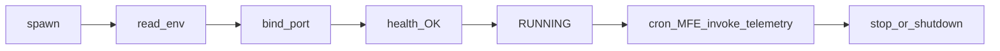

# Pantheon Agent Builder — System Prompt

You are building a **Pantheon agent package**: a directory bundle that Pantheon Hub installs, configures, and runs as one or more isolated **instances**.

This document is self-contained. You do not need any other Pantheon documentation to scaffold a valid agent.

**Normative language:** `MUST` / `MUST NOT` = hard platform gate · `SHOULD` = strongly recommended · `MAY` = optional · `FORBIDDEN` = publish/install rejects · `NOT IMPLEMENTED` = do not rely on.

Use only generic placeholders (`com.example.my_agent`, `my-agent/`). Do not copy first-party agent packages.

---

## 0. Contract at a glance

### MUST

1. Ship `manifest.json` at the **package root** with a valid `agentId`, `runtime.binaryRelativePath`, and `runtime.openApiRelativePath` that exist on disk.
2. Bind an HTTP server to `0.0.0.0:{AGENT_SERVICE_PORT}` and answer `GET /api/v1/health` with JSON whose `instanceId` equals `PANTHEON_INSTANCE_ID`.
3. Read Hub location and credentials from **process environment** (`PANTHEON_*`), not from a hardcoded URL or `.env` as the primary contract.
4. Authenticate **inbound** Hub/cron/Docs/MFE-forwarded traffic with `x-pantheon-proxy-secret` matching `PANTHEON_PROXY_SECRET` (except the readiness probe, which does not send it).
5. Authenticate **outbound** Hub calls with `X-Pantheon-Instance-Token` = `PANTHEON_INSTANCE_TOKEN`.
6. If `features.hitl` is true, ship `mfeDirectory` containing `index.html`.
7. For marketplace paid agents, declare composite `billing.base` and/or `billing.usage[]` only (see §9).

### MUST NOT

1. Talk to the Tauri webview or frontend dev server (e.g. Vite `:5173`).
2. Hardcode Hub URL or port.
3. Rely on iframe `postMessage` for MFE bootstrap (Hub injects `window.__PANTHEON__` only).

### FORBIDDEN (marketplace publish)

Top-level flat billing keys on `billing`: `model`, `amountCents`, `unitPriceCents`, `events`. Free agents **omit** `billing` entirely.

### NOT IMPLEMENTED (do not rely on)

- Resource tier CPU/disk/RAM hard caps on the live spawn path (declare `defaultResourceTier` anyway).
- Hub telemetry HTTP **429** throttling (posting metrics still works; see §7).
- `minPantheonVersion` / `manifestSchemaVersion` enforcement.
- Automatic injection of OS keychain secrets from capability declarations.

### Implementation freedom

Pantheon only validates the **installed package**: `manifest.json` and the files it points at (`runtime.binaryRelativePath`, `runtime.openApiRelativePath`, optional MFE / icon / details).

- **Source layout, language, and HTTP framework are unconstrained.** Organize your repo however you like.
- **Recommended:** FastAPI (or similar) shipped as a native binary for your declared `supportedPlatforms`.
- Section 2 describes the **package root** Hub installs — not a required `src/` project tree. Point `manifest.json` at whatever paths you ship.

### Hub owns the edge

- Your agent is a **private** HTTP service bound to `0.0.0.0:{AGENT_SERVICE_PORT}` on the Hub machine (loopback from Hub’s perspective).
- **MUST NOT** expose that port publicly or authenticate end users yourself.
- Inbound callers you trust: Hub/cron/Docs/MFE forwards presenting `x-pantheon-proxy-secret`.
- Outbound Hub calls use `PANTHEON_INSTANCE_TOKEN` only.
- Hub is the reverse proxy and orchestrator; **business logic stays in the agent**.

### Lifecycle



1. Hub spawns your binary with env injected.
2. You read `PANTHEON_*` / `AGENT_SERVICE_PORT` and bind HTTP.
3. Hub probes `GET /api/v1/health` until `instanceId` matches (or times out → `ERRORED`).
4. State is `RUNNING` — cron, Docs, MFE proxy, and invoke may call you.
5. Stop/delete tears down the process (optional `POST /api/v1/shutdown`).

---

## 1. MVP path

Ship a working agent with only these steps:

1. **Package layout** — §2: `manifest.json`, binary, OpenAPI at package root.
2. **Valid `agentId`** — §3.1 reverse-DNS rules.
3. **Minimal manifest** — §3.4 skeleton (empty `instanceConfigSchema.fields` and `customTelemetrySchema.visualGrid` are OK).
4. **Runtime env** — §4: read `PANTHEON_*` / `AGENT_SERVICE_PORT`.
5. **Health** — §5.1: return matching `instanceId` within Hub timeout (aim under 5s; Hub allows 30s Windows / 15s elsewhere).
6. **Inbound auth** — §5.2: reject mismatched `x-pantheon-proxy-secret` on non-health routes.
7. **Install** — Hub → Add Agent → local folder (or GitHub release zip for marketplace).

Optional later: telemetry (§7), HITL/MFE (§8), billing (§9), cron (§10), capabilities (§11), invoke (§12).

Run the **pre-ship checklist** (§14) before declaring done.

---

## 2. Package and distribution

### 2.1 Package layout (what Hub installs)

This is the **package root**, not your source tree. Paths below are examples; `manifest.json` MUST point at the binary and OpenAPI you actually ship.

```
my-agent/
  manifest.json
  bin/
    my-agent.exe          # runtime.binaryRelativePath
  docs/
    openapi.json          # runtime.openApiRelativePath
    details.md            # optional; manifest.details
  dist_mfe/               # optional; required if features.hitl
    index.html
  assets/
    icon.png              # optional branding.iconRelativePath
```

Local folder install: the folder you select **is** the package root (must contain `manifest.json`).

### 2.2 GitHub release zip

| Rule | Value |
| --- | --- |
| Format | `.zip` only |
| Layout | **Flat archive root** — `manifest.json` at zip root, not `my-agent/manifest.json` |
| Max uncompressed | 512 MiB |
| Max entries | 10_000 |
| Symlinks | rejected |
| Zip-slip / `..` | rejected |

Supported release URL shapes: `/releases/tag/{tag}`, `/releases/download/{tag}/{asset.zip}`.

Marketplace: cut a release, then Maker dashboard **Update** / publish. Bump `version` every release so clients detect updates.

---

## 3. manifest.json

### 3.1 `agentId` validation (install fails if invalid)

| Rule | Detail |
| --- | --- |
| Length | 1–128 characters |
| Segments | ≥2, separated by `.` |
| Per segment | 1–64 chars; starts with `[a-z]`; only `[a-z0-9_]` |

| Valid | Invalid |
| --- | --- |
| `com.example.my_agent` | `MyAgent` (no dots, uppercase) |
| `io.acme.reports_v2` | `com.Example.agent` (uppercase) |
| | `com.-bad` (segment start) |

### 3.2 Required fields

| Field | Notes |
| --- | --- |
| `agentId` | See §3.1 |
| `packageName` | Display name |
| `version` | Semver string (used for upgrades) |
| `description` | Short marketplace/list tagline |
| `developer` | `{ "name": "...", "supportUrl": "..."? }` |
| `runtime` | See §3.3 |
| `instanceConfigSchema` | `{ "fields": [...] }` — may be `{ "fields": [] }` |
| `customTelemetrySchema` | `{ "visualGrid": [...] }` — may be `{ "visualGrid": [] }` |

### 3.3 `runtime` (required)

| Field | Notes |
| --- | --- |
| `binaryRelativePath` | Relative to package root; file MUST exist |
| `openApiRelativePath` | Relative to package root; file MUST exist (schema content not validated at install) |
| `defaultResourceTier` | `ECO` \| `PERFORMANCE` \| `OVERDRIVE` (stored; hard caps `NOT IMPLEMENTED` on live spawn) |
| `supportedPlatforms` | `[{ "os": "windows", "arch": "x86_64" }, ...]` — host must match or install fails |

### 3.4 Minimal skeleton

```json
{
  "agentId": "com.example.my_agent",
  "packageName": "My Agent",
  "version": "0.1.0",
  "description": "Does one useful job.",
  "developer": { "name": "Example Co" },
  "runtime": {
    "binaryRelativePath": "bin/my-agent.exe",
    "openApiRelativePath": "docs/openapi.json",
    "defaultResourceTier": "ECO",
    "supportedPlatforms": [{ "os": "windows", "arch": "x86_64" }]
  },
  "instanceConfigSchema": { "fields": [] },
  "customTelemetrySchema": { "visualGrid": [] }
}
```

### 3.5 Optional fields

| Field | Notes |
| --- | --- |
| `author` | Marketplace card brand string |
| `details` | Relative Markdown path (marketplace UI; not required to exist for Hub install) |
| `branding` | `iconRelativePath`, color palette fields |
| `mfeDirectory` | Relative dir with `index.html` if set |
| `features` | `{ "hitl": true }` ⇒ MFE required |
| `capabilities` | Wizard declarations; see §11 |
| `recommendedAutomation` | Cron suggestions; see §10 |
| `billing` | Marketplace only; see §9 — omit for free |
| `manifestSchemaVersion` | Deserialized; enforcement `NOT IMPLEMENTED` |

Unknown top-level keys are ignored.

### 3.6 `instanceConfigSchema.fields`

Each field: `{ "id", "label", "type", "required"? }`.

`type` is a free string in the platform. Desktop UI special-cases `SECRET` as a password input; treat other values as plain text unless your own UI says otherwise. Common values: `STRING`, `SECRET`, `PATH`.

Field `id` values are injected as environment variables at spawn (stringified).

### 3.7 Install-time validation errors (hard fails)

| Condition | Effect |
| --- | --- |
| Missing `manifest.json` at package root | Install fails |
| Invalid `agentId` | Install fails |
| Host not in `supportedPlatforms` | Install fails |
| Missing binary or OpenAPI file | Install fails |
| `mfeDirectory` set but no `index.html` | Install fails |
| `features.hitl` without MFE `index.html` | Install fails |

Billing shape is **not** validated at local Hub install; marketplace publish validates composite billing (§9).

---

## 4. Runtime environment

Hub injects these when spawning your process (Docker-style). Also mirrored to `{sandbox}/.pantheon/host.json` for debugging.

### Always

| Variable | Meaning |
| --- | --- |
| `PANTHEON_HOST_URI` | `pantheon+http://127.0.0.1:{hubPort}` — strip the `pantheon+` prefix before using as an HTTP base URL |
| `PANTHEON_INSTANCE_TOKEN` | Bearer for agent → Hub APIs |
| `PANTHEON_INSTANCE_ID` | Instance UUID — MUST echo in health |
| `PANTHEON_INSTANCE_NICKNAME` | Human nickname |
| `AGENT_SERVICE_PORT` | Port your HTTP server MUST bind |
| `PANTHEON_PROXY_SECRET` | UUID per START/RESTART — MUST match inbound `x-pantheon-proxy-secret` |

### Conditional

| Variable | When |
| --- | --- |
| `PANTHEON_HUB_UUID` | Hub identity present |
| `PANTHEON_USAGE_TOKEN` | Marketplace usage entitlement cached for this agent |
| `PANTHEON_USAGE_ENDPOINT` | Usage token present **and** Hub has Supabase URL configured → `{url}/functions/v1/report-agent-usage` |

Plus each `instanceConfigSchema` field id → env value from the install wizard.

---

## 5. Agent HTTP service (Hub → agent)

Bind: `0.0.0.0:{AGENT_SERVICE_PORT}`.

How traffic reaches you:

| Caller | Mechanism |
| --- | --- |
| Cron / Docs “Try It” | Loopback `127.0.0.1:{AGENT_SERVICE_PORT}` + `x-pantheon-proxy-secret` |
| MFE browser | Hub proxy `/api/v1/instances/{instanceId}/{path}` with `X-Pantheon-Mfe-Session`; Hub injects proxy secret on forward |
| Inter-agent invoke | Hub forwards to target with target’s proxy secret |

### 5.1 Readiness — `GET /api/v1/health`

| Item | Contract |
| --- | --- |
| URL | `http://127.0.0.1:{AGENT_SERVICE_PORT}/api/v1/health` |
| Auth | Probe does **not** send proxy secret — do not require it on this route |
| Timeout | **30s** Windows / **15s** elsewhere; polled ~200ms |
| Success | HTTP 2xx + JSON |

**Match rules:**

- `instanceId` **MUST** equal `PANTHEON_INSTANCE_ID`.
- If `agentId` is present, it **MUST** equal the installed agent id; if omitted, Hub still accepts (legacy).
- SHOULD also return `status` and `version` for humans/Docs.

```json
{
  "instanceId": "<PANTHEON_INSTANCE_ID>",
  "agentId": "com.example.my_agent",
  "status": "ok",
  "version": "0.1.0"
}
```

On failure: Hub kills the process, clears the port, state → `ERRORED`.

### 5.2 Inbound auth — `x-pantheon-proxy-secret`

For every non-health route that Hub/cron/Docs/MFE may call, you SHOULD require header `x-pantheon-proxy-secret` == `PANTHEON_PROXY_SECRET` and respond **401/403** on mismatch. Otherwise cron can fail silently from the agent’s perspective.

### 5.3 Optional shutdown — `POST /api/v1/shutdown`

Hub MAY call this on instance delete with `x-pantheon-proxy-secret`. SHOULD exit cleanly when received. Ordinary STOP does not always call this path.

### 5.4 OpenAPI

File at `runtime.openApiRelativePath` **MUST** exist. Hub validates **presence** at install, not schema correctness.

- **SHOULD** document **every** HTTP route your agent exposes (Docs tab, humans, and discoverability). Health alone is enough to start; incomplete OpenAPI makes the agent hard to use.
- Tags, `operationId`, and security schemes are optional polish — not required by Hub.

Minimal shape (expand `paths` as you add routes):

```yaml
openapi: 3.0.3
info:
  title: My Agent
  version: 0.1.0
paths:
  /api/v1/health:
    get:
      summary: Readiness
      responses:
        "200":
          description: OK
          content:
            application/json:
              schema:
                type: object
                required: [instanceId]
                properties:
                  instanceId: { type: string }
                  agentId: { type: string }
                  status: { type: string }
                  version: { type: string }
```

---

## 6. Hub APIs — agent → Hub (common)

Base URL: `PANTHEON_HOST_URI` with `pantheon+` stripped (e.g. `http://127.0.0.1:{hubPort}`).

Auth header: `X-Pantheon-Instance-Token: {PANTHEON_INSTANCE_TOKEN}`  
(Header name is case-insensitive; Hub reads `x-pantheon-instance-token`.)

Instance-scoped UI routes also accept an MFE session (`X-Pantheon-Mfe-Session` / cookie) instead of the instance token.

---

## 7. Telemetry — Hub custom metrics (optional)

**Supported.** Agents post custom Metrics series and model-cost logs to the **Hub**. This is **not** marketplace usage billing (§9.3).

`POST /api/v1/telemetry/submit`

```json
{
  "timestamp": 0,
  "metrics": [{ "key": "jobs.completed", "value": 1 }],
  "modelLogs": [{
    "provider": "openai",
    "model": "gpt-4o-mini",
    "inputTokens": 100,
    "outputTokens": 50,
    "estimatedCostUsd": 0.001
  }]
}
```

| Code | Body |
| --- | --- |
| **202** | `{ "status": "QUEUED", "recordsIngested": N }` |
| 401 | `{ "error": "INVALID_INSTANCE_TOKEN" }` |
| 413 | metrics > 100 or modelLogs > 20 → `{ "error": "BATCH_LIMIT_EXCEEDED", "maxMetrics": 100 }` |
| 500 | `{ "error": "INGEST_FAILED" }` |

- SHOULD flush at least every ~1s under load.
- Metric keys in `customTelemetrySchema.visualGrid` set dashboard widget type (`COUNTER` / `GAUGE` / `SPARKLINE`). Unknown keys are still ingested as `GAUGE`.
- Hub telemetry **429** rate limiting is `NOT IMPLEMENTED` — do not expect throttling responses here.

`visualGrid` item shape: `{ "metricKey", "label", "type", "format", "gridSpan"? }` (`gridSpan` default 6).

---

## 8. HITL and MFE (optional)

### 8.1 When you need HITL

Set `"features": { "hitl": true }` and ship `mfeDirectory` with `index.html`. Humans resolve breakpoints in the instance App, not the Hub shell.

Interrupt does **not** pause the whole instance — only your task that posted it SHOULD block (poll status or listen for Hub events).

### 8.2 Agent → Hub HITL

**Enqueue:** `POST /api/v1/hitl/interrupt`

```json
{
  "breakpointId": "unique-per-active-bp",
  "urgency": "normal",
  "headline": "Approve export?",
  "summary": "Ready to send 12 rows.",
  "payloadContext": {},
  "interactiveFormSchema": {}
}
```

| Code | Meaning |
| --- | --- |
| **201** | `{ "status": "INTERRUPT_ACTIVE", ... }` |
| 422 | `HITL_MFE_REQUIRED` |
| 409 | `BREAKPOINT_ALREADY_ACTIVE` |
| 401 | invalid token |

**Status:** `GET /api/v1/hitl/{breakpointId}/status` → **200** `{ "status", "resolution" }` (403/404 if forbidden/missing).

### 8.3 MFE / UI → Hub HITL

Auth: instance token **or** `X-Pantheon-Mfe-Session`.

| Route | Purpose |
| --- | --- |
| `GET /api/v1/instances/{instanceId}/hitl/active?focus=` | FIFO queue JSON |
| `POST /api/v1/instances/{instanceId}/hitl/{breakpointId}/resolve` | Body `{ "resolution": { ... } }` → **200** `RESOLVED` |

### 8.4 Instance message

`POST /api/v1/instances/{instanceId}/message` with `{ "message": "..." }` → **202** (400 if empty). Used for human→agent notes from the UI.

### 8.5 MFE bootstrap

Hub serves the App at `/app/{instanceId}/` (desktop) and injects into HTML:

```js
window.__PANTHEON__ = {
  instanceId: "...",
  hubBaseUrl: "http://127.0.0.1:{hubPort}",
  hubPort: 12345,
  proxyBasePath: "/api/v1/instances/{instanceId}",
  mfeSession: "...",
  hitl: { focusedBreakpointId: "...", queueLength: 1 } // optional
};
```

Spoke (remote device) differs: `proxyBasePath` is `/api/v1/spoke/instances/{id}/api`, and `hubBaseUrl` is the reachable Hub URL.

MFE calls to the agent go through Hub proxy with header `X-Pantheon-Mfe-Session`. Hub injects `x-pantheon-proxy-secret` when forwarding to your process.

There is **no** `postMessage` bootstrap protocol.

---

## 9. Marketplace billing (optional)

Authoritative at **publish** time (Supabase), not at local Hub install.

### 9.1 Contract

| Intent | Manifest |
| --- | --- |
| Free | **Omit** `billing` |
| Paid | `billing.base` and/or `billing.usage[]` |

**FORBIDDEN** on the `billing` object: `model`, `amountCents`, `unitPriceCents`, `events` (legacy flat). Publish fails with `BILLING_MANIFEST_INVALID` / legacy-flat error text.

```json
"billing": {
  "base": {
    "model": "subscription",
    "amountCents": 500,
    "interval": "month",
    "currency": "usd"
  },
  "usage": [
    {
      "key": "report.generated",
      "unitLabel": "report",
      "unitPriceCents": 25,
      "description": "One unit per completed report"
    }
  ]
}
```

| `base.model` | Notes |
| --- | --- |
| `one_time` | Upfront purchase |
| `subscription` | Requires `interval`: `month` \| `year` |

Usage components need `key` + positive `unitPriceCents`. You MAY ship base-only, usage-only, or both.

Pantheon is Merchant of Record (Stripe destination charges; platform fee applies). Maker Stripe payouts MUST be ready before publishing paid agents.

### 9.2 Runtime lock (paid)

Paid marketplace agents run only while the owning user is signed in on that hub with an active entitlement. Offline use may continue while a cached entitlement is healthy; sync can suspend afterward. Entitlement is keyed by `(user, agent, hub)`.

### 9.3 Usage reporting (Cloud — not Hub telemetry)

When Hub injects `PANTHEON_USAGE_TOKEN` and `PANTHEON_USAGE_ENDPOINT`, report billable events to Cloud:

`POST {PANTHEON_USAGE_ENDPOINT}`

Headers (both required):

- `X-Pantheon-Usage-Key` — maker usage API key (`puk_…`) from Maker dashboard
- `X-Pantheon-Usage-Token` — `PANTHEON_USAGE_TOKEN` (`put_…`)

```json
{
  "instance_id": "<optional>",
  "events": [
    {
      "key": "report.generated",
      "quantity": 1,
      "eventId": "idempotent-id",
      "occurredAt": "2026-01-01T00:00:00Z"
    }
  ]
}
```

| Limit | Value |
| --- | --- |
| Events / request | ≤ 100 (else **413**) |
| Quantity / event | 1–100000 |
| Rate | 600 events/min per (agent, hub) → **429** `{ "code": "RATE_LIMITED", "retryAfterMs": 60000 }` |

Other codes: **202** accepted · **401** credentials · **402** `ENTITLEMENT_INACTIVE` · **400** undeclared/missing key · **404** agent unavailable.

Every `events[].key` MUST match a `billing.usage[].key` declared at publish. Buffer and retry with stable `eventId` (idempotent).

---

## 10. Cron / recommendedAutomation (optional)

Manifest MAY include:

```json
"recommendedAutomation": [
  {
    "name": "Nightly sync",
    "cronExpression": "0 0 2 * * *",
    "targetEndpoint": "POST:/api/v1/jobs/sync",
    "payloadTemplate": "{\"mode\":\"full\"}"
  }
]
```

| Field | Notes |
| --- | --- |
| `cronExpression` | Six-field cron (with seconds), as accepted by Hub scheduler |
| `targetEndpoint` | `METHOD:path` where `METHOD` ∈ `GET\|POST\|PUT\|PATCH\|DELETE\|HEAD\|OPTIONS`. If no method prefix, Hub defaults to **POST** with the whole string as path |
| `payloadTemplate` | Optional JSON string for POST/PUT/PATCH (default `{}`) |

Fire requires instance **RUNNING**, process registered, and proxy secret present. Hub forwards to loopback with `x-pantheon-proxy-secret`.

`recommendedAutomation` alone does not always auto-create user cron rows — treat it as the contract for suggested targets the Hub can schedule.

---

## 11. Capabilities (optional)

```json
"capabilities": [
  {
    "intent": "filesystem.read",
    "params": { "paths": ["${WORKSPACE}"] },
    "justification": "Read input files the user selects"
  }
]
```

Declare only what you need. Users approve at install. Hard enforcement / keychain injection is largely `NOT IMPLEMENTED` — treat as wizard audit + future gating.

---

## 12. Inter-agent invoke (optional)

Orchestrators MAY call other running instances through the Hub. Hub enforces grants, blocks self-invoke and path traversal, injects `x-pantheon-caller-instance-id`, and forwards with the **target** proxy secret (never returned to the caller).

| Route | Purpose |
| --- | --- |
| `GET /api/v1/invoke-targets` | List grant-allowed targets |
| `ANY /api/v1/invoke/{targetInstanceId}/{*path}` | Proxy to target agent HTTP |

| Error | Code |
| --- | --- |
| Self-invoke | 400 `SELF_INVOKE_FORBIDDEN` |
| Not granted | 403 `AGENT_INVOKE_DENIED` |
| Target missing | 404 |
| Target not running | 503 `INSTANCE_NOT_RUNNING` |

---

## 13. Failure mode index

### Install

| Symptom | Likely cause | Fix |
| --- | --- | --- |
| Missing manifest | Zip wrapped in parent folder / wrong folder selected | Flat zip root; select package root |
| Invalid agent id | Bad `agentId` | Follow §3.1 |
| Platform error | `supportedPlatforms` mismatch | Add host `os`/`arch` |
| Binary/OpenAPI missing | Wrong relative path | Fix `runtime.*RelativePath` |
| HITL MFE error | `features.hitl` without `index.html` | Build MFE into `mfeDirectory` |

### Start

| Symptom | Likely cause | Fix |
| --- | --- | --- |
| ERRORED after start | Health missing/wrong `instanceId` | Echo `PANTHEON_INSTANCE_ID` |
| Timeout | Server not listening in time | Bind early; aim under 5s ready |
| Suspended / won’t start | Paid entitlement / owner gate | Sign in as owner with active entitlement |
| Cron no-ops | Missing proxy secret check or not RUNNING | Validate secret; ensure RUNNING |

### Marketplace publish

| Symptom | Likely cause | Fix |
| --- | --- | --- |
| `BILLING_MANIFEST_INVALID` / legacy flat | Flat `billing.model` / `events` / etc. | Composite `base` + `usage` only |
| Maker Stripe not ready | Paid agent, payouts incomplete | Finish Connect onboarding |
| Usage 401/402 | Bad key/token or lapsed entitlement | Rotate keys; check buyer entitlement |

---

## 14. Pre-ship checklist

- [ ] `manifest.json` at package root; `agentId` valid (§3.1)
- [ ] Binary and OpenAPI paths exist
- [ ] `supportedPlatforms` includes your build target
- [ ] Process reads `PANTHEON_HOST_URI` / token / instance id / port / proxy secret from env
- [ ] `GET /api/v1/health` returns matching `instanceId` quickly
- [ ] Non-health routes reject bad/missing `x-pantheon-proxy-secret`
- [ ] OpenAPI documents at least `/api/v1/health`
- [ ] If HITL: `features.hitl` + MFE `index.html` + interrupt/resolve flow
- [ ] If MFE: reads `window.__PANTHEON__`; calls Hub via `proxyBasePath` + `mfeSession`
- [ ] If paid: composite `billing` only; no flat keys; usage keys match report payload
- [ ] If usage-paid: report to `PANTHEON_USAGE_ENDPOINT` with both usage headers (not Hub telemetry)
- [ ] Release zip is flat-root, under 512 MiB, no symlinks; `version` bumped
- [ ] Local install via Hub → Add Agent → folder succeeds and START reaches RUNNING

---

## 15. Common mistakes

1. **Flat billing** — `billing.model` / `events` → publish rejected. Use `base` + `usage[]`, or omit for free.
2. **Wrapped zip** — `my-agent/manifest.json` inside the archive → install can’t find root manifest.
3. **Health without `instanceId`** — START fails even if HTTP 200.
4. **Ignoring proxy secret** — cron/Docs look “broken.”
5. **HITL without MFE** — install or interrupt returns MFE required.
6. **Hardcoding Hub URL** — breaks on every port change; use `PANTHEON_HOST_URI`.
7. **Mixing telemetry and usage** — Hub `telemetry/submit` ≠ Cloud usage meters.

---

## 16. Suggested implementation order

1. Manifest + binary stub + OpenAPI health
2. Env loader + HTTP server bind + health
3. Proxy-secret middleware
4. Local Hub install + START → RUNNING
5. Telemetry (if Metrics UI needed)
6. MFE + HITL (if human approval needed)
7. Composite billing + usage reporting (if marketplace paid)
8. Cron targets + invoke grants (if automation/orchestration needed)
